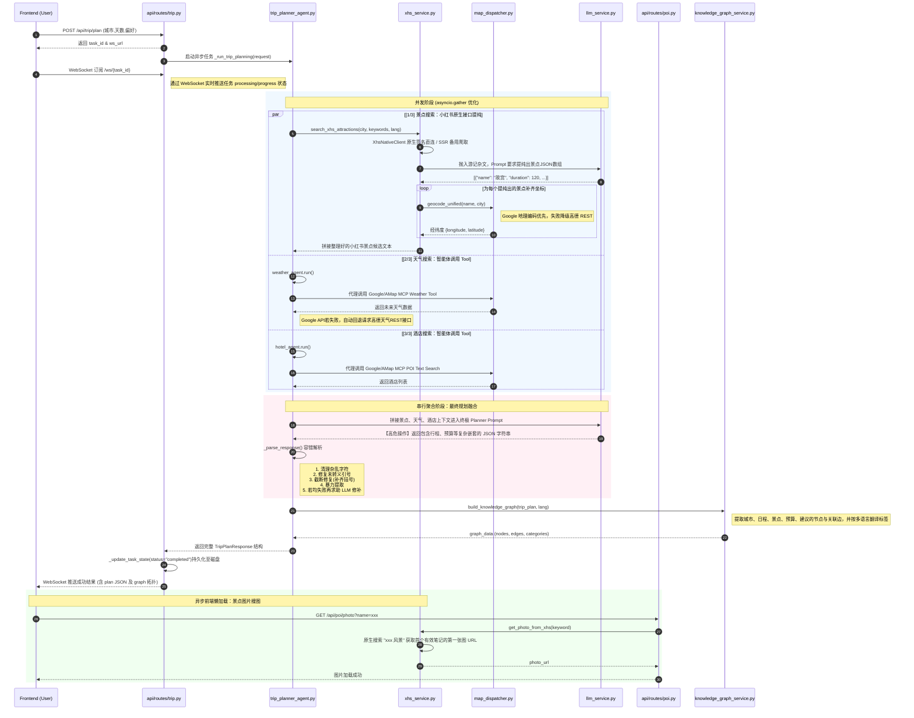

<div align="center" style="display: flex; justify-content: center; align-items: center; gap: 2px;">
  
</div>
<p align="center">
  
  
  
  
  
  
</p>

<div align="center">

[🇨🇳 中文](README.md) | [🇺🇸 English](README_en.md) | [🇯🇵 日本語](README_ja.md)


# 旅途星辰 - AI 旅行智能体
**基于 HelloAgents 框架打造的多智能体协作文旅规划平台**
</div>


> [!IMPORTANT]
> 
> 可直接体验项目，完整体验项目功能可自行本地部署，**受风控影响在线体验没有接入小红书**：[旅途星辰 (TripStar) - AI 旅行智能体](https://modelscope.cn/studios/lcclxy/Journey-to-the-China)
> 
> 其中包括：旅行计划、景点地图概览、预算明细、每日行程：行程描述、交通方式、住宿推荐、景点安排（地址、游览时长、景点描述、预约提醒）、餐饮安排、天气信息、知识图谱可视化、沉浸式伴游 AI 问答......

## 项目简介

**旅途星辰 (TripStar)** 是一个创新的 AI 文旅智能体应用，基于 HelloAgents 框架打造的多智能体协作文旅规划平台，旨在解决用户在规划旅行时面临的"信息过载"和"决策疲劳"问题。

有别于传统的旅游攻略网站，本项目采用了基于 **大语言模型 (LLM)** 和 **多智能体 (Multi-Agent)** 协作架构的创新模式。它能像一位经验丰富的人类旅行管家一样，全面考虑用户的个性化需求（偏好设置：交通方式、住宿风格、旅行兴趣、特殊需求等），自动搜索旅行信息、查询当地天气、精选酒店并规划最优景点路线，以**快速完成旅游攻略**。

### 核心亮点

* **小红书深度集成**: 景点推荐与攻略数据直接来源于小红书真实用户游记，通过 LLM 智能提纯，获取最真实的避坑指南与打卡建议。景点图片也通过小红书实时搜索获取，确保展示的是网友最新实拍的真实风景照。
* **景点预约提醒**: 智能识别小红书游记中提及的需要提前预约的景点（如故宫、陕西历史博物馆等），在行程卡片中醒目标注预约提示与预约渠道信息，防止白跑一趟。
* **多语言与国际化支持**: 深度集成 Vue I18n，同时在 LLM 提示词层及知识图谱底层实现语言自适应适配。系统界面及 AI 问答全程支持多语言（中/英/日）无缝切换，连同生成的旅行规划数据会自动翻译为目标语言，为全球旅行者打造无障碍的行程规划体验。
* **双地图引擎高定互动展现**: 深度集成并支持 **Google Maps** 与 **高德地图 (AMap)** 双引擎的无缝切换与自动回退。国外使用 Google Maps，国内回退高德。动态绘制"起点-景点-终点"的真实经纬度打卡路线，提供高级定制底图配色，一眼预览景点位置方便安排行程。
* **精准预算明细面板**: 智能汇总门票、餐饮、住宿与交通等多维度花销账单，提供直观的财务面板报表，让出行预算尽在掌握。
* **多智能体协作协同**: 采用分工明确的多个 Agent（如天气预报员、酒店推荐专家），通过工作流 (Workflow) 协同完成复杂的旅行规划任务。
* **知识图谱可视化**: 将生成的行程数据实时转换为节点关系图，直观展示"城市-天数-行程节点-预算"的空间结构。
* **沉浸式伴游 AI 问答**: 在生成报告后，提供悬浮式 AI 问答窗口（左下角），AI 拥有完整行程的上下文记忆，用户可随时针对行程细节（如票价、适宜性）进行追问。
* **多城市行程规划**: 支持在一次旅行中规划多个城市，动态添加城市并设置停留天数，系统自动计算总行程天数。城际移动日智能标注交通建议，预算面板独立统计城际交通费用，天气面板按城市分别展示，知识图谱以多城市拓扑呈现完整路线。
* **奢华暗黑玻璃拟物风**: 全新设计的暗黑系玻璃拟物化 (Dark Luxury Glassmorphism) 界面，提供极具沉浸感的高级视觉体验。
---
> 举个例子要去中国——西安玩耍，只需要填写地点、日期、偏好设置，即可等待行程规划的结果，一眼预览如何安排旅游景点


## 系统架构

本项目采用标准的前后端分离架构，分为前端 Vue 交互层、后端 FastAPI 服务层和 LLM/Agents 的智能推理层。



---

## 核心功能与工作流

### 1. 异步轮询任务系统 (解决网关超时)

针对 LLM 生成超长文本易导致 504 Gateway Timeout 的痛点，重构了后端的任务调度机制。

* **`POST /api/trip/plan`**: 立即返回 `task_id`，将长达数分钟的推理任务推入后台 `asyncio.create_task`。
* **`GET /api/trip/status/{task_id}`**: 前端每 3 秒发起一次轻量请求，实时获取当前处理进度（如"🔍 正在搜索景点..."），直至状态变为 `completed`。

### 2. 多智能体架构 (Agentic Workflow)

主控 Agent 接收到用户自然语言指令后，基于 React 模式拆解任务：

1. **小红书景点提取**: 搜索城市旅游攻略帖，通过 SSR 页面抓取获取帖子正文内容，再由 LLM 从长文游记中提纯出景点名称、真实评价、游玩时长以及是否需要提前预约等结构化信息，最后通过高德 POI 搜索接口补齐精准经纬度坐标。
2. **天气与酒店**: 天气管家查询目标日期的气候状况；酒店专员根据预算寻找合适落脚点。
3. **路线编排**: 主控 Agent 收集三方数据，进行统筹优化，计算两两景点间的距离和最优游玩顺序，避免行程折返跑。
4. **景点搜图 (前端驱动)**: 行程生成完毕后，前端根据每个景点名称独立调用 `/api/poi/photo` 接口，后端以景点名搜索小红书最新发布的帖子，通过 SSR 抓取帖子首张图片直链，确保展示的是真实的风景实拍照。
5. **结果聚合**: 最终输出包含预算明细、逐日行程、预约提醒、防坑指南等详细参数的结构化 JSON。

### 3. 数据驱动的动态组件渲染

前端不再是写死的静态展示，而是通过响应式变量读取 JSON 数据：

* **高德地图 JS API 2.0 组件**: 动态读取 POI 经纬度，绘制连线与标记。
* **ECharts 知识图谱组件**: 将树状的旅行层级转化为关系网络（图数据库雏形）。

---

## 快速部署与运行指北

### 环境准备

* Python 3.10+
* Node.js 18+
* 大模型 API Key（推荐使用兼容 OpenAI 格式的服务商，如豆包）
* 高德地图两种key： Web服务 、 Web端(JS API) (其**安全密钥 JSCode**配置在index.html中)（[高德api](https://lbs.amap.com/)）
* [Google Maps API Key](https://developers.google.com/maps/apis-by-platform)（若要使用 Google 地图引擎，必须在 Google Cloud 控制台中开通：**Geocoding API, Places API (New), Directions API, Maps JavaScript API, Weather API**，需要绑卡）
* 小红书Cookie（[小红书](https://www.xiaohongshu.com/) 网页端登录后从浏览器开发者工具复制）
* 安装 `uv` 包管理器

### Docker / Compose 配置约定

推荐通过 docker-compose 一键启动项目（包含前端和后端环境），在运行之前，确保填补 `.env` 文件相关的环境变量：

* 容器启动时不再读取项目目录里的 `backend/.env`，请确保将配置以环境变量的形式传入。
* `docker-compose.yaml` 中显式配置了必要的运行时代理和 API keys，支持传入 `GOOGLE_MAPS_API_KEY` 与 `GOOGLE_MAPS_PROXY` 等变量。
* 前端构建期变量 `VITE_AMAP_WEB_JS_KEY` 会通过 `build.args` 自动注入前端。


```

本地开发仍可按下面步骤分别配置和启动 `backend/.env` 和 `frontend/.env`。

### 本地开发

#### 1. 后端启动

```bash
# 进入后端主目录
cd backend

# 安装小红书签名引擎的 Node.js 依赖
npm install

# 创建虚拟环境
python -m venv .venv

# 激活虚拟环境
source .venv/bin/activate  # Windows: .venv\Scripts\activate

# 安装项目依赖包
pip install -r requirements.txt

# 复制配置文件并填入相应的 API KEY
cp .env.example .env
# [必填] LLM_API_KEY, LLM_BASE_URL, LLM_MODEL_ID（选择有结构化输出能力的模型）
# [必填] VITE_AMAP_WEB_KEY (高德地图 web服务 类型的key)
# [必填] XHS_COOKIE（小红书网页端登录后的Cookie）
# [选填] GOOGLE_MAPS_API_KEY, GOOGLE_MAPS_PROXY（如果需要支持 Google 地图引擎）

# 启动 FastAPI (推荐通过 uvicorn)
uvicorn app.api.main:app --host 0.0.0.0 --port 8000 --reload
```

API 启动后，您可以访问 `http://localhost:8000/docs` 查看互动文档。

#### 2. 前端启动

```bash
# 进入前端主目录
cd frontend

# 使用 npm (或 pnpm/yarn) 安装依赖
npm install

# 配置前端环境变量，创建 .env 文件
# [必填] VITE_AMAP_WEB_KEY 与后端保持一致
# [必填] VITE_AMAP_WEB_JS_KEY 必须是 Web端(JS API) 类型的key
# 另外，由于 JS API 2.0 政策要求，**还需要在 index.html 注入你的安全密钥(securityJsCode)**

# 启动 Vite 开发服务器
npm run dev
```


---

## 目录结构与关键代码导读

```text
TripStar/
├── backend/                       # Python FastAPI 后端
│   ├── app/
│   │   ├── api/routes/            # 核心路由 (trip.py, poi.py, chat.py)
│   │   ├── agents/                # 多智能体定义与编排 (trip_planner_agent.py 并发核心)
│   │   ├── services/              # 业务逻辑封装
│   │   │   ├── xhs_service.py     # 小红书搜索/SSR抓取/LLM提纯/搜图
│   │   │   ├── llm_service.py     # LLM 客户端封装
│   │   │   └── knowledge_graph_service.py  # 知识图谱构建
│   │   └── models/                # Pydantic 类型定义 (schemas.py)
│   └── .env                       # 本地开发环境变量载体（Docker 部署时不打进镜像）
│
├── frontend/                      # Vue 3 互动前端
│   ├── src/
│   │   ├── views/                 # 主路由视图 (Home.vue 表单输入; Result.vue 路书展示)
│   │   ├── components/            # 独立复用的 UI / 背景组件
│   │   └── services/              # Axios 异步轮询及配置重试逻辑 (api.ts)
│   ├── index.html                 # 入口挂载及高德地图 SecurityKey 预设
│   ├── .env                       # 本地前端开发环境变量（Docker 构建时忽略）
│   └── package.json
│
├── Dockerfile                     # 通用生产发布容器脚本
├── docker-compose.yaml            # 一键容器编排
└── README.md
```

> 下面是部分运行结果，丰富的功能探索中...


## 后续优化方向
- [x] ~~接入小红书，获得高质量计划~~
- [x] ~~景点图片改为从小红书获取~~
- [x] ~~景点提前预约提示~~
- [x] ~~接入 Google Maps，实现国内外双引擎自动降级回退~~
- [x] ~~模型返回语言国际化适配及底层知识图谱多语言支持~~
- [x] ~~可查看历史计划支持，通过任务和后端持久化解决~~
- [x] ~~支持代理配置 (HTTP/SOCKS5) 以确保国内可用 Google 服务~~
- [x] ~~修改导出图片的外观，增加地图，提高可读性~~
- [x] ~~支持多城市旅行~~
- [ ] 添加小红书链接以及美食推荐增强
- [ ] 前端优化

## Star History

<a href="https://www.star-history.com/?repos=1sdv%2FTripStar&type=date&logscale=&legend=top-left">
 <picture>
   <source media="(prefers-color-scheme: dark)" srcset="https://api.star-history.com/image?repos=1sdv/TripStar&type=date&theme=dark&legend=top-left" />
   <source media="(prefers-color-scheme: light)" srcset="https://api.star-history.com/image?repos=1sdv/TripStar&type=date&legend=top-left" />
   
 </picture>
</a>

## 🙏 致谢
感谢 [linuxdo](https://linux.do/) 社区的交流、分享与反馈，让 TripStar 的迭代更高效。
