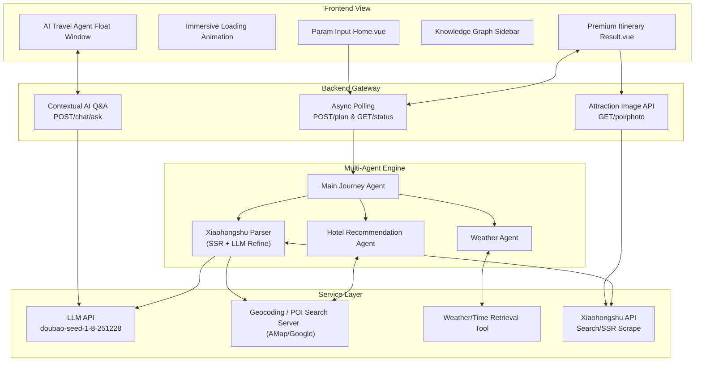

# TripStar - AI Travel Agent


> **A Multi-Agent Collaborative Travel Planning Platform Based on the HelloAgents Framework**

<p align="center">
  
  
  
  
  
  
</p>

<div align="center">

[🇨🇳 中文](README.md) | [🇺🇸 English](README_en.md) | [🇯🇵 日本語](README_ja.md)

</div>

> [!IMPORTANT]
> 
> You can try the project directly online. For the full experience, you can deploy it locally. **Due to risk control, the online trial does not connect to Xiaohongshu (RED)**: [TripStar - AI Travel Agent](https://modelscope.cn/studios/lcclxy/Journey-to-the-China)
> 
> Features include: Travel Plans, Attraction Maps Overview, Budget Details, Daily Itinerary: Itinerary Description, Transportation, Accommodation Recommendations, Attraction Scheduling (address, duration, description, reservation reminders), Dining Plans, Weather Information, Knowledge Graph Visualization, Immersive AI Q&A Companion...

## Project Introduction

**TripStar** is an innovative AI travel agent application, a multi-agent collaborative travel planning platform based on the HelloAgents framework, designed to solve the "information overload" and "decision fatigue" users face when planning trips.

Unlike traditional travel guide websites, this project adopts an innovative model based on **Large Language Models (LLM)** and **Multi-Agent** collaboration. Like an experienced human travel butler, it comprehensively considers users' personalized needs (preferences: transportation, accommodation style, travel interests, special requests, etc.), automatically searching for travel info, checking local weather, curating hotels, and planning optimal attraction routes to **quickly generate a travel itinerary**.

### Core Highlights

* **Deep Xiaohongshu (RED) Integration**: Attraction recommendations and travel guide data come directly from real users' travelogues on Xiaohongshu. LLMs intelligently refine this data to extract the most authentic tips and check-in suggestions. Attraction images are also retrieved in real-time from Xiaohongshu, ensuring the display of the latest, authentic user-taken scenery photos.
* **Attraction Reservation Reminders**: Intelligently identifies attractions mentioned in Xiaohongshu travelogues that require advance booking (e.g., the Forbidden City, Shaanxi History Museum), distinctly highlighting reservation prompts and channels in the itinerary cards to save you a wasted trip.
* **Multi-Language & Internationalization Support**: Deeply integrates Vue I18n, while natively supporting language localization at both the LLM prompt level and the knowledge graph data structure. The system UI and AI Q&A seamlessly switch between multiple languages (Chinese/English/Japanese), dynamically translating generated travel plans into the target language to provide a barrier-free trip planning experience for global travelers.
* **Dual-Engine Custom Interactive Map**: Deeply integrates and supports seamless switching and automatic fallback between **Google Maps** and **AMap (GaoDe)**. Uses Google Maps overseas and falls back to AMap domestically. Dynamically draws a real latitude and longitude route ("Start - Attraction - End"), with high-end customized basemap colors, giving an instant preview of attraction locations for easy itinerary scheduling.
* **Precise Budget Detail Panel**: Intelligently aggregates multi-dimensional expenses like tickets, dining, accommodation, and transportation, providing an intuitive financial panel to keep your travel budget in check.
* **Multi-Agent Collaboration**: Employs multiple agents with clear divisions of labor (e.g., Weather Forecaster, Hotel Recommendation Expert), working together via a defined Workflow to complete complex travel planning tasks.
* **Knowledge Graph Visualization**: Real-time conversion of generated itinerary data into a node-relationship graph, intuitively displaying the spatial structure of "City - Days - Itinerary Nodes - Budget".
* **Immersive AI Q&A Companion**: After generating the report, provides a floating AI Q&A window (bottom left). The AI retains complete contextual memory of the itinerary, allowing users to ask follow-up questions at any time regarding itinerary details (like ticket prices, or suitability).
* **Multi-City Trip Planning**: Plan trips spanning multiple cities in one journey. Dynamically add cities with individual stay durations, and the system auto-calculates the total travel days. Inter-city transfer days are smartly annotated with transportation suggestions, the budget panel tracks inter-city transport costs separately, the weather panel displays forecasts per city, and the knowledge graph renders the full multi-city route topology.
* **Luxury Dark Glassmorphism Design**: A completely redesigned Dark Luxury Glassmorphism UI, offering a highly immersive, premium visual experience.

---
> For example, if you want to travel to USA-NewYork, simply fill in the destination, dates, and preferences, wait for the itinerary planning results, and preview how to arrange your tour at a glance.


## System Architecture

The project uses a standard decoupled frontend-backend architecture, divided into the Vue frontend interaction layer, FastAPI backend service layer, and the LLM/Agents intelligent inference layer.



---

## Core Features & Workflow

### 1. Asynchronous Polling System (Solves Gateway Timeout)

To solve the 504 Gateway Timeout issue caused by long-duration LLM inference, the backend routing mechanism was refactored:

* **`POST /api/trip/plan`**: Instantly returns a `task_id`, pushing the multi-minute inference task into the background via `asyncio.create_task`.
* **`GET /api/trip/status/{task_id}`**: The frontend makes lightweight polling requests every 3 seconds to get the real-time processing progress (e.g., "🔍 Searching for attractions...") until the status hits `completed`.

### 2. Multi-Agent Architecture (Agentic Workflow)

Upon receiving natural language instructions, the Main Agent breaks down the task using ReAct:

1. **Xiaohongshu Attraction Extraction**: Searches city travel guide posts, extracts their text via an SSR scraper, and then uses the LLM to refine the lengthy travelogues into structured data: attraction names, authentic reviews, play durations, and reservation requirements. Finally, a POI search API is used to fetch precise coordinates.
2. **Weather & Hotel**: The Weather agent queries the climate for the target dates; the Hotel agent finds suitable lodging options based on the budget.
3. **Route Orchestration**: The Main Agent gathers third-party data, orchestrates the workflow, and calculates the distances and optimal visit orders to avoid backtracking.
4. **Attraction Image Search (Frontend Driven)**: After generating the itinerary, the frontend independently calls the `/api/poi/photo` endpoint for each attraction. The backend then searches for the newest posts on Xiaohongshu based on the attraction name, scraping the direct link of the first image via SSR, ensuring an authentic real-life snapshot.
5. **Result Aggregation**: The final output is structured JSON encompassing budget details, daily schedules, reservation reminders, and anti-scam tips.

### 3. Data-Driven Dynamic Component Rendering

The frontend renders dynamic Vue structures recursively by reading JSON data:

* **Map JS API Components**: Dynamically reads POI coordinates to draw polylines and map markers.
* **ECharts Knowledge Graph**: Translates the hierarchical travel structure into a relational node network (an early form of a graph database).

---

## Quick Deployment Guide

### Environment Prerequisites

* Python 3.10+
* Node.js 18+
* Large Model API Key (OpenAI-compatible endpoints highly recommended, e.g., Doubao)
* AMap Keys (Web Service & Web JS API) with **Security JSCode configured in `index.html`** or Google Maps APIs. If using [Google Maps](https://developers.google.com/maps/apis-by-platform), you must enable: **Geocoding API, Places API (New), Directions API, Maps JavaScript API, and Weather API** in Google Cloud Console, and an active billing account is strictly required.
* Xiaohongshu Cookie (Retrieve from browser dev tools after logging in on Web)
* The `uv` package manager

### Docker / Compose Conventions

It is highly recommended to start the project (both frontend and backend) via `docker-compose`. Ensure your `.env` variables are configured before starting:

* The backend does NOT read the `backend/.env` file during container startup. All config is passed via environments setup.
* `docker-compose.yaml` explicitly maps essential proxies and API keys, supporting variables like `GOOGLE_MAPS_API_KEY` and `GOOGLE_MAPS_PROXY`.
* Frontend build-time variable `VITE_AMAP_WEB_JS_KEY` is injected via `build.args`.

**One-Click Start Command:**
```bash
# Build and run containers in background
docker-compose up -d --build

# Follow service logs
docker-compose logs -f
```

For local development, follow the distinct environment configurations below.

### Local Development

#### 1. Start Backend

```bash
# Navigate to backend directory
cd backend

# Install Node.js dependencies for Xiaohongshu signature engine
npm install

# Create virtual environment with uv
uv venv .venv

# Activate virtual environment
source .venv/bin/activate  # Windows: .venv\Scripts\activate

# Install project dependencies
uv pip install -r requirements.txt

# Copy config and fill your API KEYs
cp .env.example .env
# [Required] LLM_API_KEY, LLM_BASE_URL, LLM_MODEL_ID (pick a model good at JSON struct)
# [Optional] VITE_AMAP_WEB_KEY
# [Required] XHS_COOKIE
# [Required] GOOGLE_MAPS_API_KEY, GOOGLE_MAPS_PROXY

# Start FastAPI (Uvicorn recommended)
uvicorn app.api.main:app --host 0.0.0.0 --port 8000 --reload
```
Once the API is live, visit `http://localhost:8000/docs` to test Interactive Swagger integrations.

#### 2. Start Frontend

```bash
# Navigate to frontend directory
cd frontend

# Install dependencies (npm/pnpm/yarn)
npm install

# Copy config and fill your Keys
cp .env.example .env
# [Required] VITE_AMAP_WEB_KEY (Same as backend)
# [Required] VITE_AMAP_WEB_JS_KEY 
# **MUST ALSO inject Security JSCode in index.html (AMap API v2.0 requirement)**

# Run Vite dev server
npm run dev
```

---

## Directory Structure

```text
TripStar/
├── backend/                       # Python FastAPI Backend
│   ├── app/
│   │   ├── api/routes/            # Core routing (trip.py, poi.py, chat.py)
│   │   ├── agents/                # Agent definitions (trip_planner_agent.py)
│   │   ├── services/              # Business logic layers
│   │   │   ├── xhs_service.py     # RED Parsing/SSR/LLM
│   │   │   ├── llm_service.py     # Base LLM Wrapper
│   │   │   └── knowledge_graph_service.py  # KG formatting
│   │   └── models/                # Pydantic Schemas
│   └── .env                       # Local Env
│
├── frontend/                      # Vue 3 Frontend UI
│   ├── src/
│   │   ├── views/                 # Views (Home.vue; Result.vue)
│   │   ├── components/            # UI components
│   │   └── services/              # Async polling & retries
│   ├── index.html                 # Index Entry & AMap Token injection
│   ├── .env                       # Frontend Local Env
│   └── package.json
│
├── Dockerfile                     # Generic Prod Docker
├── docker-compose.yaml            # Single-node Compose Setup
└── README_en.md
```
> Below are some of the operation results, exploring rich functions...


## Future Optimizations
- [x] ~~Xiaohongshu Integration~~
- [x] ~~Attraction Images via Xiaohongshu Search~~
- [x] ~~Attraction Reservation Prompts~~
- [x] ~~Google Maps Dual-Engine Fallback~~
- [x] ~~i18n Multi-Language Model Inference Adaptation & Deep Knowledge Graph Translation~~
- [x] ~~History Plans Record Support~~
- [x] ~~HTTP/SOCKS5 Proxy Config~~
- [x] ~~Better Export Image aesthetics~~
- [x] ~~Multi-City Travel Planning~~
- [ ] Advanced Dining Recommendations

## Star History

<a href="https://www.star-history.com/?repos=1sdv%2FTripStar&type=date&logscale=&legend=top-left">
 <picture>
   <source media="(prefers-color-scheme: dark)" srcset="https://api.star-history.com/image?repos=1sdv/TripStar&type=date&theme=dark&legend=top-left" />
   <source media="(prefers-color-scheme: light)" srcset="https://api.star-history.com/image?repos=1sdv/TripStar&type=date&legend=top-left" />
   
 </picture>
</a>

## 🙏 Acknowledgements
Thanks to the [linux.do](https://linux.do/) community for communication and feedback, making TripStar iterate more efficiently.
